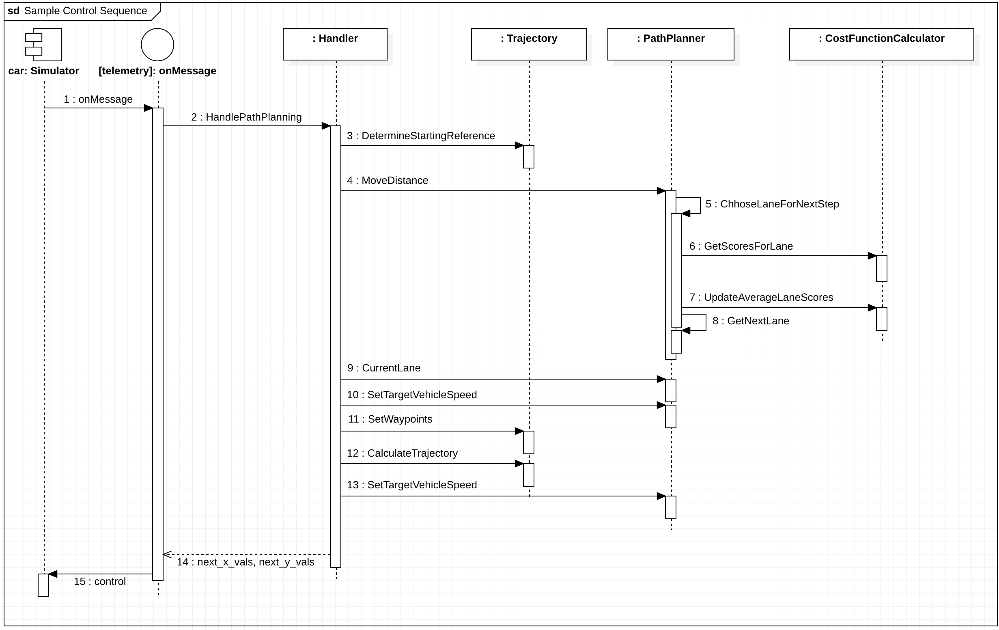

# Path Planning Project

I completed this project as part of [Udacity](https://www.udacity.com)'s [Self-driving CarData Engineer Nanodegree](https://www.udacity.com/course/self-driving-car-engineer-nanodegree--nd013). 

# Project Goal

The goal of this project is to build a path planner that creates smooth, safe trajectories for the car to follow. The highway track has other vehicles, all going different speeds, but approximately obeying the 50 MPH speed limit.

The objective is to safely navigate around a virtual highway with other traffic that is driving +-10 MPH of the 50 MPH speed limit. 

We are provided with the car's localization and sensor fusion data. There is also a sparse map list of waypoints around the highway. The car should try to go as close as possible to the 50 MPH speed limit, which means passing slower traffic when possible. 

Note that other cars will try to change lanes too. The car should avoid hitting other cars at all cost as well as driving inside of the marked road lanes at all times, unless going from one lane to another. 

The car should be able to make one complete loop around the 6946m highway. Since the car is trying to go 50 MPH, it should take a little over 5 minutes to complete 1 loop. Also the car should not experience total acceleration over 10 m/s^2 and jerk that is greater than 10 m/s^3.

The map of the highway is in [highway_map.csv](data/highway_map.csv).
Each waypoint in the list contains `[x,y,s,dx,dy]` values. `x` and `y` are the waypoint's map coordinate position, the s value is the distance along the road to get to that waypoint in meters, the `dx` and `dy` values define the unit normal vector pointing outward of the highway loop.

This is a sample extract from [highway map data](data/highway_map.csv) showing what the data looks like:

```text
...
784.6001 1135.571 0 -0.02359831 -0.9997216
815.2679 1134.93 30.6744785308838 -0.01099479 -0.9999396
844.6398 1134.911 60.0463714599609 -0.002048373 -0.9999979
875.0436 1134.808 90.4504146575928 -0.001847863 -0.9999983
905.283 1134.799 120.689735412598 0.004131136 -0.9999915
934.9677 1135.055 150.375551223755 0.05904382 -0.9982554
...
```

The highway's waypoints loop around so the frenet s value, distance along the road, goes from 0 to 6945.554.

# Details
The car uses a perfect controller and will visit every `(x,y)` point it recieves in the list every .02 seconds. The units for the `(x,y)` points are in meters and the spacing of the points determines the speed of the car. The vector going from a point to the next point in the list dictates the angle of the car. Acceleration both in the tangential and normal directions is measured along with the jerk, the rate of change of total Acceleration. The `(x,y)` point paths that the planner recieves should not have a total acceleration that goes over 10 m/s^2, also the jerk should not go over 50 m/s^3. (NOTE: As this is BETA, these requirements might change. Also currently jerk is over a .02 second interval, it would probably be better to average total acceleration over 1 second and measure jerk from that.

There will be some latency between the simulator running and the path planner returning a path, with optimized code usually its not very long maybe just 1-3 time steps. During this delay the simulator will continue using points that it was last given, because of this its a good idea to store the last points you have used so you can have a smooth transition. The previous path's values for `x`, and `y` can be helpful for this transition since they show the last points given to the simulator controller with the processed points already removed. You would either return a path that extends this previous path or make sure to create a new path that has a smooth transition with this last path.


# Project Specification

|Category | Criteria | Specification | Status
|:--- | :--- | :--- | :---:
**Compilation** | The code compiles correctly.| Code must compile without errors with cmake and make. | Done
**Valid Trajectories** | The car is able to drive at least 4.32 miles without incident.| The top right screen of the simulator shows the current/best miles driven without incident. Incidents include exceeding acceleration/jerk/speed, collision, and driving outside of the lanes. Each incident case is also listed below in more detail. | Done 
| | The car drives according to the speed limit. | The car doesn't drive faster than the speed limit. Also the car isn't driving much slower than speed limit unless obstructed by traffic. | Done
| | Max Acceleration and Jerk are not Exceeded.| The car does not exceed a total acceleration of 10 m/s^2 and a jerk of 10 m/s^3. | Done
| | CarData does not have collisions. | The car must not come into contact with any of the other cars on the road. | Done
| | The car stays in its lane, except for the time between changing lanes. | The car doesn't spend more than a 3 second length out side the lane lanes during changing lanes, and every other time the car stays inside one of the 3 lanes on the right hand side of the road. | Done
| | The car is able to change lanes | The car is able to smoothly change lanes when it makes sense to do so, such as when behind a slower moving car and an adjacent lane is clear of other traffic. | Done
**Reflection** | There is a reflection on how to generate paths.|The code model for generating paths is described in detail. This can be part of the README or a separate doc labeled "Model Documentation". | Done

I uploaded to YouTube a full MP4 video of the car successfully navigating the track, and meeting all project specifications. You can watch the full video here:

[](https://youtu.be/bQqwraRQjDE "Video of car driving autonomously for a full lap")

This animated GIF shows an extract that demonstrates overtaking a car by moving to the left lane, amd also move safely from the left lane to the middle lane, and then to the right lane.

)

This animated GIF shows an extract that demonstrates overtaking a car by moving to the left lane, and then back to the center lane. Then it overtakes a car by moving from the center lane to the right lane.

)

For contrast, here is a **bad** example where the car just drives in circles. There are lots of collisions, and the car exceeds acceleration, speed, and jerk limits. I created this when I was learning how to get the car to move - this is not part of the current implementation. 


# Solution Overview

The content of [src](src) directory is as follows:

```
src
 |-- Eigen-3.3/
 |-- spline.h
 |-- json.hpp
 |
 |-- coordinate_transforms.h
 |-- distance_utils.h
 |-- json_utils.h
 |
 |-- path_planner.h
 |-- path_planner.cpp
 |-- trajectory.h
 |-- trajectory.cpp
 |-- cost_function_calculator.h
 |-- cost_function_calculator.cpp
 |-- waypoints.h
 |-- car.h
 |-- handler.h
 |-- handler.cpp
 |
 |-- main.cpp
```

`Eigen-3.3`, `spline.h`, and `json.hpp` are [3rd-party dependencies](#important-dependencies) I imported for this project. The remainder of the files are created for this project. Here is a summary of their responsibilities: 

Entity | Responsibilities
:---|:---
main|The entry point - contains the event listeners that capture events from the simulator and send messages to the simulator.
Path Planner | Plan a path by deciding whether to move left, right, or stay in the same lane. Work with the Cost Function Calculator to decide which lane to be in for the next step of the path. Figure out the lead vehicle's current speed, and set the target speed for the vehicle.
Trajectory | Determine the starting reference, set waypoints, and calculate trajectories. 
Cost Function Calculator | Assist driving decisions by calculating costs and benefits of particular scenarios.
Waypoint | Manage map values for waypoint's `x`,`y`,`s` and `d` normalized normal vectors. Calculate closest waypoint to current `(x, y)` position. Figure out the next waypoint of the closest waypoint. 
Car | Manage data associated with the car, including localization, sensor fusion data, and previous path data.
Coordinate Transforms | Functions to transform between Frenet and Cartesian coordinates, and vice versa.
Distance Utils | Some helper functions for working with distances, e.g. converting between degrees and radians.
JSON Utils | Helper functions for abstracting the details of marshalling JSON data.
Handler | Serve as the entry point to path planning. Called when the event listener detects a telemetry event. Returns the control data that the event listener uses to respond to the simulator.


The majority of the code in [main.cpp](src/main.cpp) is dedicated to handling communications with the simulator. We use the uWebSockets library to communicate with the simulator. The primary event handler for this project is `onMessage()`. 

I implemented a [Handler](src/handler.cpp) to handle the message events from the simulator. Every time `main` receive an `onMessqage` event from the simulator, the event listener calls the `handle.HandlePathPlanning()` function. This one function call serves as the entry point to my Path Planning implementation, and abstracts away the details of how I implement path planning. This also means I can try different implementation options without changing the event handling code.   

```c++
...

#include "path_planner.cpp"
#include "trajectory.cpp"
#include "handler.cpp"
#include "waypoints.h"
#include "car.h"

...

int main()
{
  PathPlanner path_planner;
  Trajectory trajectory = Trajectory(&path_planner);
  Handler handler = Handler(&trajectory);
  MapWaypoints map_waypoints;  // map values for waypoint's x,y,s and d normalized normal vectors

  ...
  h.onMessage(
          [&handler, &map_waypoints]
          (uWS::WebSocket<uWS::SERVER> ws, char *data, size_t length,uWS::OpCode opCode)
  {
  ...

      if(event == "telemetry")
      {
          // data for the main car
          CarData car_data = GetCarData(j);
          
          // Define the actual (x,y) points we will use for the planner
          vector<double> next_x_vals;
          vector<double> next_y_vals;
          
          handler.HandlePathPlanning(
                  map_waypoints,
                  car_data,
                  next_x_vals,
                  next_y_vals);

      ...
      }
      ...
}
```

The code first creates a `PathPlanner` object, then uses that to create and initialize a `Trajectory` object. The `Handler` object is created and initialized using the `Trajectory` object.

This sequence diagram illustrates the main flow that happens when we receive a telemetry message from the simulator:



This is a simplified view intended to show the relationships among the primary entities. There are many more details in the code for managing things like converting between Frenet and Cartesian coordinate, setting map maypoints, etc.

# Design Notes

The goal of this project is to build a path planner that creates smooth, safe trajectories for the car to follow. The highway track has other vehicles, all going different speeds, but approximately obeying the 50 MPH speed limit.

The car transmits its location, along with its sensor fusion data, which estimates the location of all the vehicles on the same side of the road.

## Point Paths
The path planner should output a list of `x` and `y` global map coordinates. Each pair of `x` and `y` coordinates is a point, and all the points together form a trajectory. We can use any number of points that we want, but the `x` list should be the same length as the `y` list.

These are represented in the code by `next_x_vals` and `next_y_vals`. These values are populated by my path planner, and sent in a JSON message to the simulator, as shwon: 

```c++
...
     handler.HandlePathPlanning(map_waypoints,
                                 car_data,
                                 next_x_vals,
                                 next_y_vals);

      json msgJson;
      msgJson["next_x"] = next_x_vals;
      msgJson["next_y"] = next_y_vals;

      auto msg = "42[\"control\"," + msgJson.dump() + "]";

      ws.send(msg.data(), msg.length(), uWS::OpCode::TEXT);
...
```

Every 20 ms the car moves to the next point on the list. The car's new rotation becomes the line between the previous waypoint and the car's new location.

The car moves from point to point perfectly, so we don't have to worry about building a controller for this project.

## Velocity
The velocity of the car depends on the spacing of the points. Because the car moves to a new waypoint every 20ms, the larger the spacing between points, the faster the car will travel. The speed goal is to have the car traveling at (but not above) the 50 MPH speed limit as often as possible. But there will be times when traffic gets in the way.

## Acceleration and Jerk

Acceleration is calculated by comparing the rate of change of average speed over intervals of 0.2 seconds. The jerk is calculated as the average acceleration over 1-second intervals. In order for the passenger to have an enjoyable ride both the jerk and the total acceleration should not exceed 10 m/s^2.

Part of the total acceleration is the normal component, `acceleration` which measures the centripetal acceleration from turning. The tighter and faster a turn is made, the higher the `acceleration` value will be.

For this project we need to consider how to minimize total acceleration and jerk by gradually increasing and decreasing point path spacing based on the `speed` variable in [CarData.Localization](src/car.h).

## Complex Paths

### Using Previous Path Points

Using information from the previous path ensures that there is a smooth transition from cycle to cycle. But the more waypoints we use from the previous path, the less the new path will reflect dynamic changes in the environment.

The `CarData` struct in [car.h](src/car.h) manages the previous path data:

```c++

struct CarData
{
    ...
    
    struct PreviousPath
    {
        // Previous path data given to the Planner
        vector<double> x;
        vector<double>  y;

        // Previous path's end s and d values
        double s = 0.0;
        double d = 0.0;
    } previous_path;
    
    ...
};

```

Ideally, we might only use a few waypoints from the previous path and then generate the rest of the new path based on new data from the car's sensor fusion information.

The function `Trajectory::DetermineStartingReference` in [trajectory.cpp](src/trajectory.cpp) does exantly this:

```c++
    // if previous size is almost empty, use the car as starting reference
    if(previous_path_size < 2)
    {
        // use two points that make the path tangent to the car
        double prev_car_x = car.localization.x - cos(car.localization.yaw);
        double prev_car_y = car.localization.y - sin(car.localization.yaw);

        ptsx.push_back(prev_car_x);
        ptsx.push_back(car.localization.x);

        ptsy.push_back(prev_car_y);
        ptsy.push_back(car.localization.y);

        reference_velocity = car.localization.speed;
    }
    else  // use the previous path's end point as starting reference
    {
        // Redefine reference state as previous path end point
        ref_x = car.previous_path.x[previous_path_size - 1];
        ref_y = car.previous_path.y[previous_path_size - 1];

        double ref_x_prev = car.previous_path.x[previous_path_size - 2];
        double ref_y_prev = car.previous_path.y[previous_path_size - 2];
        ref_yaw = atan2(ref_y - ref_y_prev, ref_x - ref_x_prev);
        reference_velocity = this->path_planner->TargetVehicleSpeed();

        // Use two points that make the path tangent to the previous path's end point
        ptsx.push_back(ref_x_prev);
        ptsx.push_back(ref_x);

        ptsy.push_back(ref_y_prev);
        ptsy.push_back(ref_y);
    }

```

### Timing
The simulator runs a cycle every 20 ms (50 frames per second), but my C++ path planning program will provide a new path at least one 20 ms cycle behind. The simulator will simply keep progressing down its last given path while it waits for a new generated path.

This means that using previous path data becomes even more important when higher latency is involved. Imagine, for instance, that there is a 500ms delay in sending a new path to the simulator. As long as the new path incorporates a sufficient length of the previous path, the transition will still be smooth.

A concern, though, is how accurately we can predict other traffic 1-2 seconds into the future. An advantage of newly generated paths is that they take into account the most up-to-date state of other traffic.

### Setting Point Paths with Latency
My C++ path planner will at the very least be one cycle behind the simulator because the C++ program can't receive and send data on the same cycle. As a result, any path that the simulator receives will be from the perspective of a previous cycle. This might mean that by the time a new path reaches the simulator, the vehicle has already passed the first few waypoints on that path.

Luckily we don't have to worry about this too much for this project. The simulator has built-in tools to deal with this timing difference. The simulator actually expects the received path to be a little out of date compared to where the car is, and the simulator will consider which point on the received path is closest to the car and adjust appropriately.

## Highway Map

### About the Highway
* The [map file](data/highway_map.csv) contains a list of waypoints that go all the way around the track. 
* The track contains a total of 181 waypoints, with the last waypoint mapping back around to the first. The waypoints are in the middle of the double-yellow dividing line in the center of the highway.
* The track is 6945.554 meters around (about 4.32 miles). If the car averages near 50 MPH, then it should take a little more than 5 minutes for it to go all the way around the highway.
* The highway has 6 lanes total - 3 heading in each direction. Each lane is 4 m wide and the car should only ever be in one of the 3 lanes on the right-hand side. The car should always be inside a lane unless doing a lane change.

### Waypoints and Highway Measurements
Each waypoint has an `(x,y)` global map position, and a Frenet s value and Frenet d unit normal vector (split up into the `x` component, and the `y` component).

The `s` value is the distance along the direction of the road. The first waypoint has an s value of `0` because it is the starting point.

The `d` vector has a magnitude of `1` and points perpendicular to the road in the direction of the right-hand side of the road. The `d` vector can be used to calculate lane positions. For example, if you want to be in the left lane at some waypoint just add the waypoint's `(x,y)` coordinates with the `d` vector multiplied by 2. Since the lane is 4 m wide, the middle of the left lane (the lane closest to the double-yellow dividing line) is 2 m from the waypoint.

If you would like to be in the middle lane, add the waypoint's coordinates to the `d` vector multiplied by 6 = (2+4), since the center of the middle lane is 4 m from the center of the left lane, which is itself 2 m from the double-yellow dividing line and the waypoints.


### Converting Frenet Coordinates

There is a helper function, `Frenet2Cartesian()`, in [coordinate_transforms.h](src/coordinate_transforms.h) which takes in Frenet `(s,d)` coordinates and transforms them to `(x,y)` coordinates.

### Interpolating Points

To estimate the location of points between the known waypoints, we need to "interpolate" the position of those points.

Once we have a polynomial function, we can use it to interpolate the location of a new point.

There are also other methods we could use. For example, Bezier curve fitting with control points, or spline fitting, which guarantees that the generated function passes through every point.


## Sensor Fusion

It is important that the car does not crash into any of the other vehicles on the road, all of which are moving at different speeds around the speed limit and can change lanes.

The `sensor_fusion` variable contains all the information about the cars on the right-hand side of the road.

The data format for each car is: `[ id, x, y, vx, vy, s, d]`. 
* The `id` is a unique identifier for that car. 
* The `x, y` values are in global map coordinates.
* The `vx, vy` values are the velocity components, also in reference to the global map. 
* Finally `s` and `d` are the Frenet coordinates for that car.

The `vx, vy` values can be useful for predicting where the cars will be in the future. For instance, if you were to assume that the tracked car kept moving along the road, then its future predicted Frenet `s` value will be its current `s` value plus its (transformed) total velocity (m/s) multiplied by the time elapsed into the future (s).

In the telemetry data we get from the simulator, `sensor_fusion` data is an array of arrays of doubles, and maps to `CarData.sensor_fusion` in [car.h](src/car.h). Here is an example:

```text
 sensor_fusion = [
 [0,893.2054,1124.788,21.1046,-0.006357825,108.6152,10.01459],
 [1,1097.721,1179.32,18.37469,4.132454,320.2971,5.299209],
 [2,851.775,1128.87,22.85236,0.1001407,67.20206,6.016924],
 [3,1069.526,1173.91,18.21947,7.60966,291.1885,2.044408],
 [4,862.811,1124.864,23.25937,-0.07619298,78.25157,9.984876],
 [5,1088.623,1176.916,17.06661,5.189817,310.8874,5.436582],
 [6,1064.369,1163.103,15.33794,6.362561,282.2615,10.02508],
 [7,762.1,1425.2,0,0,6709.296,-270.7039],
 [8,762.1,1429,0,0,6663.543,-273.1828],
 [9,762.1,1432.9,0,0,6660.444,-275.5511],
 [10,762.1,1436.3,0,0,6657.743,-277.6157],
 [11,762.1,1441.7,0,0,6653.453,-280.8947]
 ]
```

## Changing Lane

The last consideration is how to create paths that can smoothly changes lanes. Any time the ego vehicle approaches a car in front of it that is moving slower than the speed limit, the ego vehicle should consider changing lanes.

The car should only change lanes if such a change would be safe, and also if the lane change would help it move through the flow of traffic better.

For safety, a lane change path should optimize the distance away from other traffic. For comfort, a lane change path should also result in low acceleration and jerk. The acceleration and jerk part can be solved from linear equations for `s` and `d` functions. 

The `Eigen-3.3` library can solve such linear equations. The `Frenet2Cartesian` helper function can transform `(s,d)` points to `(x,y)` points for the returned path.

# Building and running the project

## Code Style

This project employs [Google's C++ style guide](https://google.github.io/styleguide/cppguide.html).

## Important Dependencies

* cmake >= 3.19
    * All OSes: [click here for installation instructions](https://cmake.org/install/)
* make >= 4.1 (Linux, Mac), 3.81 (Windows)
    * Linux: make is installed by default on most Linux distros
    * Mac: [install Xcode command line tools to get make](https://developer.apple.com/xcode/features/)
    * Windows: [Click here for installation instructions](http://gnuwin32.sourceforge.net/packages/make.htm)
* gcc/g++ >= 5.4
    * Linux: gcc / g++ is installed by default on most Linux distros
    * Mac: same deal as make - [install Xcode command line tools](https://developer.apple.com/xcode/features/)
    * Windows: recommend using [MinGW](http://www.mingw.org/)
* uWebSockets
    * Set up and install [uWebSocketIO](https://github.com/uWebSockets/uWebSockets)
    * Note: the branch `e94b6e1` is the version of `uWebSocketIO` that works with the Udacity simulator
* JSON for Modern C++ >= version 3.0.0
    * Available from https://github.com/nlohmann/json
    * Included in this project in the header [json.hpp](src/json.hpp)
* C++ cubic spline interpolation
    * The latest version is [from GitHub](https://github.com/ttk592/spline/)  
    * Included in this project in the header [spline.h](src/spline.h)

## Basic Build Instructions

1. Clone this repo.
2. Make a build directory: `mkdir build && cd build`
3. Compile: `cmake .. && make`
    * On Windows, you may need to run: `cmake .. -G "Unix Makefiles" && make`
4. Run it: `./path_planning`


# References

* Tino Kluge. [Cubic Spline interpolation in C++](https://kluge.in-chemnitz.de/opensource/spline/). kluge.in-chemnitz.de/.
* Werling, M., Ziegler, J., Kammel, S. and Thrun, S., 2010, May. Optimal trajectory generation for dynamic street scenarios in a frenet frame. In 2010 IEEE International Conference on Robotics and Automation (pp. 987-993). IEEE.
* Mirowski, P., Grimes, M., Malinowski, M., Hermann, K.M., Anderson, K., Teplyashin, D., Simonyan, K., Zisserman, A. and Hadsell, R., 2018. Learning to navigate in cities without a map. Advances in Neural Information Processing Systems, 31, pp.2419-2430.
* Krishnan, S., Ramakrishnan, R. and Arvindh, V., 2018. A look at motion planning for autonomous vehicles at an intersection. arXiv preprint arXiv:1806.07834.
* Fridman, L., Terwilliger, J. and Jenik, B., 2018. Deeptraffic: Crowdsourced hyperparameter tuning of deep reinforcement learning systems for multi-agent dense traffic navigation. arXiv preprint arXiv:1801.02805.
* Ni, J., Chen, Y., Chen, Y., Zhu, J., Ali, D. and Cao, W., 2020. A survey on theories and applications for self-driving cars based on deep learning methods. Applied Sciences, 10(8), p.2749.
* Coad, J., Qiao, Z. and Dolan, J.M., 2020. Safe Trajectory Planning Using Reinforcement Learning for Self Driving. arXiv preprint arXiv:2011.04702.


